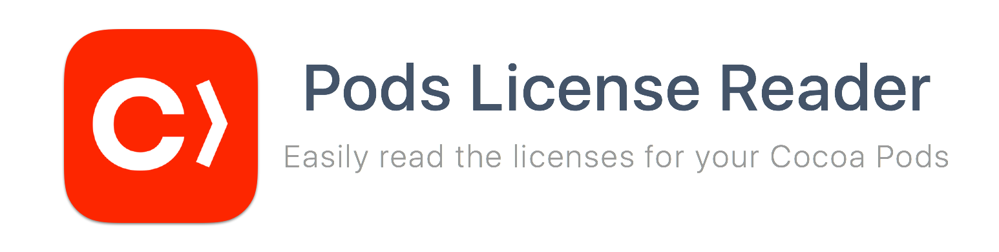

### Overview

PodsLicenseReader allows you to easily read licenses for your Cocoa Pods.

# Usage 

### Quick Start

##### Cocoa Pods

Add the following to your Podfile:

```ruby
pod 'PodsLicenseReader'
```
##### Carthage 

Add the following to your Cartfile:

```ruby
github "comyarzaheri/PodsLicenseReader" "master"
```

### Using a PodsLicenseReader

Add a reference to `Pods/Target Supporting Files/Pods/Pods-acknowledgements.plist` to your project and make sure the file is listed in `Copy Bundle Resources` under `Build Phases` in your project settings.


```swift
import PodsLicenseReader

for license in PodsLicenseReader().getLicenses() {
	// Dreams come true here
	print(license.name)
}
```

# License 

PodsLicenseReader is available under the [MIT License](LICENSE).

# Contributors

* [@comyarzaheri](https://github.com/comyarzaheri)
